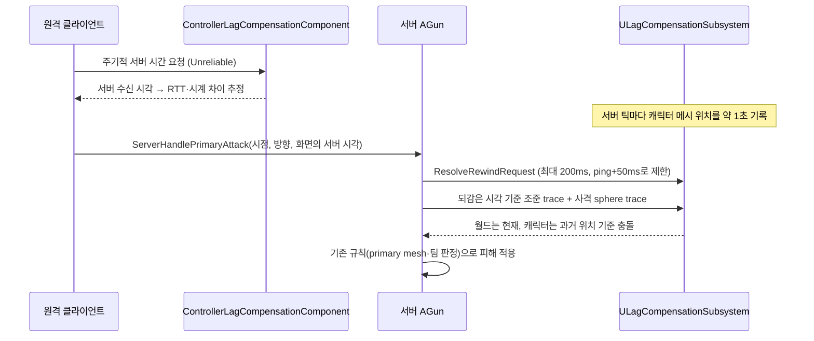

# 전용 서버와 지연 보상

일반 플레이는 계속 **Listen Server**를 사용합니다. 전용 서버는 같은 코드에 서버 전용 경로를 추가한 것입니다. 이 문서는 AWS 없이 로컬에서 끝나는 두 단계만 다룹니다.

1. 전용 서버로 한 판을 끝까지 진행하기
2. 서버 되감기로 지연 보상 판정하기

GameLift·로그인·DB 연동은 이 두 단계가 검증된 뒤에 진행합니다([다음 단계](#다음-단계-aws)).

> 이 변경은 이 저장소 환경에서 컴파일하거나 실행해 보지 못했습니다. 첫 빌드와 아래 검증 절차로 확인이 필요합니다.

## Listen Server에 미치는 영향

전용 서버용 분기는 모두 `NM_DedicatedServer` 또는 `IsRunningDedicatedServer()` 조건 안에 있습니다. Listen Server 흐름은 그대로입니다.

- 방 생성·`?listen` 이동과 Steam 세션을 그대로 씁니다.
- 로비 시작 버튼과 강퇴는 여전히 호스트가 합니다.
- 호스트 이탈 시 종료 흐름도 같습니다.

지연 보상은 두 서버 모드에 모두 적용됩니다. 원격 클라이언트의 총 사격만 되감으며, 호스트 본인의 사격은 지연이 없으므로 현재 상태로 판정합니다.

## 1단계: 전용 서버

### 빌드

- `Source/LabProjectServer.Target.cs` (`TargetType.Server`)를 추가했습니다.
- 패키징된 서버를 빌드하려면 소스로 빌드한 엔진이 필요합니다.
- Linux 서버는 Windows에서 크로스 컴파일 툴체인으로 빌드합니다.

엔진을 소스로 빌드하기 전에도, 에디터 바이너리로 전용 서버 모드를 띄워 흐름을 먼저 확인할 수 있습니다.

```bat
:: 서버 (ServerDefaultMap = LV_Title, 전용 서버는 바로 로비 맵으로 이동)
UnrealEditor.exe "<경로>\LabProject.uproject" -server -log -port=7777

:: 클라이언트 두 개
UnrealEditor.exe "<경로>\LabProject.uproject" 127.0.0.1:7777 -game -log -windowed -ResX=1280 -ResY=720
```

PIE에서는 Net Mode를 `Play As Client`로 두고 플레이어 수를 2로 설정합니다.

### 전용 서버에서 바뀌는 동작

| 위치 | 전용 서버 동작 | 이유 |
| --- | --- | --- |
| `UPdGameInstance::Init` | `GameNetDriver`를 `IpNetDriver`로 교체 | 서버는 IP:포트로 접속받습니다(GameLift 경로). 클라이언트의 `SteamNetDriver`는 `steam.` 주소가 아니면 IP로 연결합니다. |
| `Config/DefaultEngine.ini` | `ServerDefaultMap=LV_Title` | 맵 인자 없이 실행해도 알려진 맵에서 시작합니다. |
| `ATitleGameMode::BeginPlay` | `DA_Level.LobbyLevel`로 `ServerTravel` | 타이틀은 로컬 메뉴 화면이므로, 서버는 로비에서 접속을 받습니다. |
| `ALobbyGameMode::UpdateDedicatedServerAutoStart` | 최소 인원과 팀 균형이 `AutoStartDelay` 동안 유지되면 `TryStartGame()` | 시작 버튼을 누를 호스트가 없습니다. 이후 흐름(카운트다운·잠금·이동)은 호스트 버튼과 같습니다. |
| `ULobbyTravelCoordinator::StartSessionAndTravel` | Steam 세션 시작을 생략하고 바로 전장 이동을 준비 | 전용 서버는 Steam 방 세션을 광고하지 않습니다. 기존 코드는 세션이 없으면 시작을 취소했습니다. |
| `AExperienceGameMode::Logout` | 3초 뒤에도 경기장이 비어 있으면 로비로 `ServerTravel` | Listen Server는 호스트가 나가면 서버도 끝나지만, 전용 서버는 빈 경기장에 멈춰 있었습니다. |
| `ACharacterBase::BeginPlay` | 메시 `VisibilityBasedAnimTickOption = AlwaysTickPoseAndRefreshBones` | 화면이 없는 서버에서 "보일 때만 포즈 갱신"을 쓰면 피격 판정 메시가 이전 포즈에 멈춥니다. |
| `APortalActor` | Scene Capture·Render Target·MID 생성과 캡처를 건너뜀. 순간 이동 판정은 유지 | 서버에는 포털 화면을 볼 사람이 없습니다. |
| `UOnlineSessionsSubsystem::HandleNetworkFailure` | 타이틀 이동 처리를 하지 않음 | 서버 프로세스가 `OpenLevel(Title)`을 실행하면 안 됩니다. |

로비 자동 시작 설정은 서버 콘솔이나 `-ExecCmds`로 바꿉니다.

| CVar | 기본값 | 설명 |
| --- | --- | --- |
| `pd.DedicatedServer.MinPlayersToStart` | 2 | 자동 시작 최소 인원 |
| `pd.DedicatedServer.AutoStartDelay` | 5 | 조건이 유지되어야 하는 시간(초). 이후 기존 로비 카운트다운이 이어집니다. |

혼자 테스트할 때는 이렇게 실행합니다.

```bat
UnrealEditor.exe "<경로>\LabProject.uproject" -server -log -ExecCmds="pd.DedicatedServer.MinPlayersToStart 1"
```

### 이미 전용 서버를 고려하고 있던 부분

코드 전체를 점검한 결과, 서버에서 UI를 만드는 C++ 경로는 없었습니다. 다음 부분은 이미 로컬 플레이어 여부로 막혀 있습니다.

- `ExperienceGameState`의 결과 위젯
- 체력바·데미지 표시
- HUD·UiSubsystem
- BGM·오디오
- 로컬 프로필 저장
- 사격 이펙트·데칼

타이틀의 Luna 씬 캡처는 C++에 없고 Blueprint/위젯 쪽에 있습니다. 전용 서버에는 HUD가 생성되지 않고, 서버는 타이틀 맵을 바로 떠납니다. 다만 타이틀 맵에 배치된 액터가 캡처를 한다면 에디터에서 확인이 필요합니다.

### 남은 제약

- **강퇴와 맵 선택:** 둘 다 호스트 UI 기능이라 전용 서버에서는 쓰지 않습니다. 맵은 `DA_Level`의 기본 선택을 사용합니다.
- **남은 인원 처리:** 경기 중 한 명이 나가면 기존 규칙대로 경기가 정산되고, 남은 인원은 타이틀로 이동합니다. 서버가 비면 로비로 돌아갑니다.
- **타이틀 맵의 GameMode:** `ATitleGameMode`(또는 그 파생 Blueprint)여야 서버가 자동으로 로비로 이동합니다. 아니라면 서버 실행 인자에 로비 맵 경로를 직접 넣으면 됩니다.
- **GameInstance 서브시스템:** 설정·로컬라이제이션 서브시스템은 서버에서도 BGM·UI 텍스처와 폰트를 미리 로드합니다. 동작에는 문제가 없고 메모리만 더 씁니다. 서버 텍스트 생성 경로가 이 데이터를 쓸 수 있어서 이번에는 바꾸지 않았습니다.

### 검증 체크리스트

1. 서버 로그에 다음 두 줄이 나오는지 확인합니다.
   - `Dedicated server uses IpNetDriver instead of ...SteamNetDriver`
   - `Dedicated server started on the title map. Traveling to ...`
2. 클라이언트 2개가 로비에 접속하고, 서로의 캐릭터가 보이는지 확인합니다.
3. 서버 로그에 `Dedicated server lobby is ready with 2 players`가 나오고, 클라이언트에 로비 카운트다운이 표시되는지 확인합니다.
4. 경기장으로 이동해 끝까지 진행합니다(처치·리스폰·타이머·결과).
5. 결과 화면 뒤에 두 클라이언트가 함께 로비로 돌아오고, 다음 경기가 다시 자동으로 시작되는지 확인합니다.
6. 경기 중 두 클라이언트를 모두 종료하면, 서버 로그에 `All players left the dedicated server match. Returning to ...`가 나오는지 확인합니다.
7. 같은 빌드로 Listen Server 방 만들기 → 참가 → 경기 → 결과가 이전과 같은지 확인합니다.

## 2단계: 지연 보상 (서버 되감기)

### 흐름



| 코드 | 역할 |
| --- | --- |
| [`ControllerLagCompensationComponent`](../Source/LabProject/Component/Player/ControllerLagCompensationComponent.h) | 클라이언트 서버 시간 동기화. 여러 표본 중 RTT가 가장 짧은 표본의 시계 차이를 사용합니다. 공격 시 "화면의 서버 시각 = 추정 서버 시간 − RTT/2"를 보냅니다. |
| [`LagCompensationSubsystem`](../Source/LabProject/Character/LagCompensationSubsystem.h) | 서버의 캐릭터별 판정 메시 기록(링 버퍼)과 과거 시각 trace. 되감기 한도 검증과 통계를 담당합니다. |
| [`Gun`](../Source/LabProject/Weapon/Gun.cpp) / [`RangedWeaponBase`](../Source/LabProject/Weapon/RangedWeaponBase.cpp) | 사격 RPC에 시각을 추가합니다. 조준·사격 trace를 되감기 trace로 교체하고, 판정 규칙은 기존 `PdCharacterHitValidation`을 그대로 씁니다. |

### 되감기 방식

액터를 실제로 과거 위치로 옮겼다가 되돌리는 대신, 사선을 대상의 현재 좌표계로 옮겨 그 메시에만 trace합니다.

```text
과거 메시 변환 H, 현재 메시 변환 C
사선(S, E) → C · H⁻¹ 로 이동 → Mesh->SweepComponent / LineTraceComponent
충돌 지점·법선 → H · C⁻¹ 로 되돌림
```

강체 변환이므로, 액터를 되감았다가 복원한 것과 결과가 같습니다. 대신 다음 문제가 생기지 않습니다.

- overlap 이벤트가 발생하지 않습니다. 근접 무기 판정이나 맵 트리거가 오작동하지 않습니다.
- 물리 텔레포트나 부착 컴포넌트 이동이 없습니다.
- Listen Server 호스트 화면이 깜빡이지 않습니다.

벽 같은 월드 충돌은 현재 상태로 판정하고, 기록이 있는 캐릭터는 월드 trace에서 빼고 과거 위치로 따로 판정합니다. 두 결과를 거리순으로 합치므로, 이후 판정 코드(첫 유효 충돌 선택, 아군 판정, 데칼)는 바뀌지 않습니다.

악용 방지:

- 되감기 시간은 `min(pd.LagComp.MaxRewindMs, 서버 측정 ping + pd.LagComp.PingToleranceMs)`로 제한합니다.
- 범위를 벗어난 시각(NaN 포함)은 잘라내고, 잘린 사격 수를 `clamped`로 셉니다.

순간 이동(부활·포털) 구간은 보간하지 않습니다. 두 표본이 `pd.LagComp.TeleportDistance`보다 멀면 가까운 표본을 사용합니다.

### CVar와 명령

| 이름 | 기본값 | 설명 |
| --- | --- | --- |
| `pd.LagComp.Enabled` | 1 | 0이면 현재 서버 상태로 판정(비교 영상용) |
| `pd.LagComp.MaxRewindMs` | 200 | 최대 되감기 시간 |
| `pd.LagComp.PingToleranceMs` | 50 | 측정 ping에 더해 허용하는 여유 |
| `pd.LagComp.HistoryMs` | 1000 | 기록 보관 시간 |
| `pd.LagComp.TeleportDistance` | 300 | 보간하지 않는 표본 간 거리 |
| `pd.LagComp.Stats` | 0 | 1이면 매 사격마다 되감기 전·후 판정을 함께 계산해 로그를 남기고 통계를 누적 |
| `pd.LagComp.DebugDraw` | 0 | 명중 대상의 서버 현재 위치(빨강)와 되감은 위치(초록)를 서버와 사격한 클라이언트에 표시 (Shipping 제외) |
| `pd.LagComp.PrintStats` | 명령 | 이 프로세스의 모든 게임 월드 통계 출력 |
| `pd.LagComp.ResetStats` | 명령 | 통계 초기화 |

### 검증 절차 (포트폴리오 수치)

1. 전용 서버와 클라이언트를 띄웁니다. PIE라면 Editor Preferences → Play → Multiplayer Options → Network Emulation을 사용합니다.
2. 사격하는 클라이언트에서 다음을 실행합니다.
   ```text
   NetEmulation.PktLag 150
   NetEmulation.PktLoss 5
   pd.LagComp.Stats 1
   pd.LagComp.DebugDraw 1
   ```
   서버에도 `pd.LagComp.Stats 1`이 필요합니다. PIE는 한 프로세스라 CVar를 공유합니다. 별도 프로세스라면 서버를 `-ExecCmds="pd.LagComp.Stats 1"`로 실행합니다.
3. 훈련 봇이나 다른 클라이언트가 좌우로 움직이는 상태에서 총으로 50~100발 사격합니다.
4. 서버와 클라이언트에서 `pd.LagComp.PrintStats`를 실행해 다음 값을 비교합니다.
   - `hit(current)`: 되감기 없이 판정했을 때의 명중률
   - `hit(rewound)`: 실제로 적용된 되감기 판정의 명중률
   - `client perceivedHits`: 클라이언트 화면 기준으로 맞았다고 본 비율
   - `rewoundOnly`: 되감기 덕분에 인정된 명중 수
5. `pd.LagComp.Enabled 0`으로 같은 조건의 영상을 한 번 더 찍으면 적용 전후를 비교할 수 있습니다.

정상이라면 다음과 같이 나옵니다.

- `hit(rewound)`가 `client perceivedHits`에 가깝습니다.
- `avgRewind`가 측정 ping 근처입니다.
- DebugDraw에서 초록 캡슐이 클라이언트 화면의 대상 위치와 겹칩니다.

### 한계

- **적용 범위:** 히트스캔 총에만 적용됩니다. 화살·스킬 투사체는 서버가 시뮬레이션하고, 근접 공격은 서버 애니메이션 판정이라 이번 범위에서 제외했습니다.
- **포즈:** 애니메이션 포즈는 되감지 않고 현재 포즈를 씁니다(위치·회전만 되감음).
- **보간 지연:** 시뮬레이션 프록시의 이동 보간 지연(최대 약 0.1초)은 따로 더하지 않습니다. 필요하면 클라이언트가 보내는 시각에서 보간 시간을 빼는 방식으로 확장합니다.

## 다음 단계 (AWS)

아래 단계는 이 저장소에 아직 구현하지 않았습니다. 이번 변경으로 준비된 연결점만 정리합니다.

- **GameLift (3단계)**
  - 준비된 것:
    - 서버 target
    - IP 넷 드라이버
    - 호스트 없는 로비 자동 시작
    - 빈 서버의 로비 복귀
  - 할 일:
    - 플러그인의 서버 SDK 초기화와 `ProcessReady`를 `UPdGameInstance::Init`의 전용 서버 분기에서 호출합니다.
    - `PlayerSessionId` 검증을 `ALobbyGameMode::PreLogin`에 추가합니다.
    - 경기 종료 또는 빈 서버 시점(`ReturnEmptyDedicatedServerToLobby`)에서 `ProcessEnding`을 호출하고 프로세스를 종료합니다.
- **로그인과 DB (4·5단계)**
  - 전적은 전용 서버가 경기 종료 시 보고합니다. 연결 지점은 `MatchFlowComponent`의 결과 확정 지점입니다.
  - 로컬 `PlayerProfileSubsystem`은 훈련장·오프라인용으로 유지합니다.
