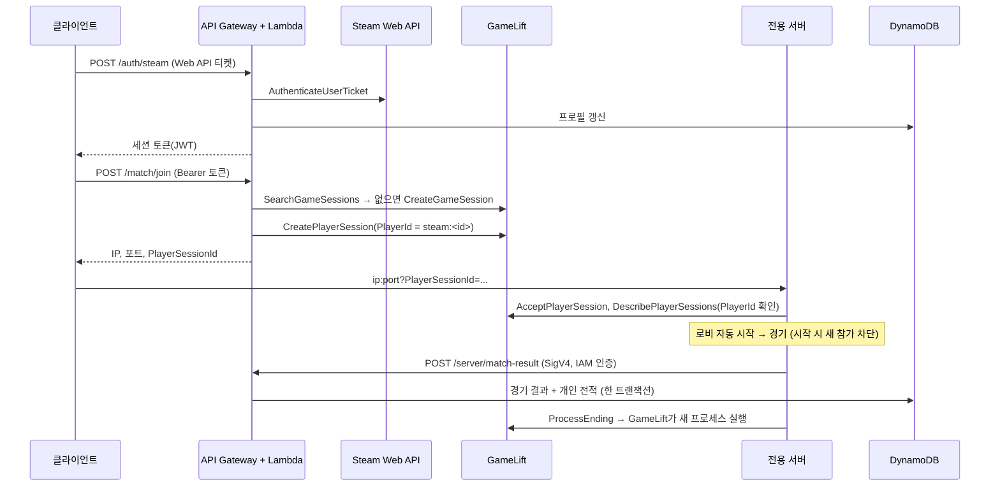

# GameLift 호스팅과 백엔드 (로그인·전적 DB)

[전용 서버와 지연 보상](DedicatedServer_LagCompensation.md)의 다음 단계입니다. 다음 세 가지를 연결합니다.

- **로그인:** Steam 계정으로 백엔드에 로그인합니다. 별도 가입 화면이 없습니다.
- **매치 참가:** 백엔드가 GameLift 게임 세션의 자리를 잡아 주고, 클라이언트는 그 전용 서버로 접속합니다.
- **전적:** 전용 서버가 경기 결과를 보고하면 DynamoDB에 누적 전적과 경기 기록을 남깁니다.

GameLift 코드는 SDK와 함께 빌드한 Server target에서, GameLift 실행 인자가 있을 때만 동작합니다. Listen Server와 GameLift 없는 로컬 전용 서버의 흐름은 바뀌지 않습니다.

## 전체 흐름



## 구성

| 위치 | 역할 |
| --- | --- |
| [`Backend/template.yaml`](../Backend/template.yaml) | HTTP API, Lambda 4개, DynamoDB 테이블, 플릿 인스턴스 역할(SAM) |
| [`Backend/src`](../Backend/src) | Lambda 코드(Python, 외부 라이브러리 없음) |
| [`Backend/deploy.ps1`](../Backend/deploy.ps1) | AWS CLI만으로 패키징·배포. 토큰 서명 키를 처음 한 번 만듭니다. |
| [`Backend/tests`](../Backend/tests) | 토큰·Steam 검증·결과 검증·트랜잭션·세션 배정 단위 테스트 |
| [`BackendClientSubsystem`](../Source/LabProject/Online/Backend/BackendClientSubsystem.h) | 클라이언트 로그인, 매치 참가, 전적 조회 |
| [`GameLiftServerSubsystem`](../Source/LabProject/Online/GameLift/GameLiftServerSubsystem.h) | 서버 SDK 수명 주기, player session 검증, 빈 세션 종료 |
| [`MatchReportSubsystem`](../Source/LabProject/Online/Backend/MatchReportSubsystem.h) | 경기 결과를 SigV4로 서명해 보고 |
| [`AwsSigV4`](../Source/LabProject/Online/Backend/AwsSigV4.h) | SHA-256·HMAC·SigV4 (AWS C++ SDK 없이 구현, 자동화 테스트로 검증) |
| [`BackendSettings`](../Source/LabProject/Online/Backend/BackendSettings.h) | API 주소, 리전, Steam identity (`DefaultGame.ini`) |

### API

| 경로 | 인증 | 설명 |
| --- | --- | --- |
| `POST /auth/steam` | 없음 | `{ticket, displayName}` → Steam 티켓을 검증하고 토큰 발급 |
| `POST /auth/dev` | 없음 | `{devId}` → 개발용 로그인. 스테이지의 `AllowDevLogin=true`일 때만 열립니다. |
| `POST /match/join` | Bearer 토큰 | 빈 자리가 있는 게임 세션을 찾거나 만들고 player session을 예약 |
| `GET /player/me` | Bearer 토큰 | 누적 전적과 최근 경기 20개 |
| `POST /server/match-result` | IAM (SigV4) | 전용 서버만 호출. 같은 경기 ID는 한 번만 기록 |

### DynamoDB (테이블 하나)

| PK | SK | 내용 |
| --- | --- | --- |
| `PLAYER#steam:<id>` | `PROFILE` | 표시 이름, 로그인 시각, `Matches/Wins/Losses/Draws/Kills/Deaths` |
| `PLAYER#steam:<id>` | `MATCH#<기록 시각>#<경기 ID>` | 그 경기의 결과·킬·데스·팀 |
| `MATCH#<경기 ID>` | `RESULT` | 경기 전체 결과, 보고한 서버의 IAM ARN |

`GET /player/me`는 PK 하나를 SK 내림차순으로 한 번 조회합니다. `PROFILE`이 `MATCH#`보다 뒤에 정렬되므로 첫 항목이 프로필이고, 나머지가 최신 경기 순서입니다.

결과 보고는 경기 결과(조건: 아직 없음)와 플레이어별 전적 갱신·기록 추가를 한 트랜잭션으로 씁니다. 서버가 같은 경기를 다시 보고해도 첫 조건이 실패해 전적이 두 번 더해지지 않습니다.

### 보안

- **클라이언트 토큰:** HS256 JWT이며, 서명 키는 SSM SecureString(`/labproject/<stage>/token-signing-key`)에 있습니다. 유효 기간은 12시간입니다.
- **결과 보고:** IAM 인증 경로라서 클라이언트 토큰으로는 호출할 수 없습니다. 서버 자격 증명은 다음 순서로 고릅니다.
  1. Anywhere 실행 인자로 받은 키
  2. 관리형 플릿의 인스턴스 역할(`GetFleetRoleCredentials`)
  3. 로컬 시험용 `AWS_*` 환경 변수
- **플레이어 ID:** 서버는 클라이언트가 보낸 값을 믿지 않습니다. `AcceptPlayerSession`으로 검증한 player session의 `PlayerId`(백엔드가 로그인 ID로 넣은 값)를 씁니다.
- **새 참가 차단:** 경기가 시작되면 `DENY_ALL`로 바꿔 새 참가를 막습니다.
- **Steam Web API 키:** 저장소에 두지 않고 SSM에만 넣습니다(`/labproject/<stage>/steam-web-api-key`).
- **호출 제한:** API 전체에 초당 10회(버스트 20)의 제한을 걸었습니다.
- **개발용 로그인:** 저장소가 공개이므로 `ApiBaseUrl`도 공개됩니다.
  - 개발용 로그인이 열린 스테이지에서는 누구나 `dev:` 토큰을 받아 `/match/join`을 호출할 수 있습니다.
  - 관리형 플릿을 연결하기 전에는 `.\Backend\deploy.ps1 -AllowDevLogin false`로 닫습니다.
  - 한 PC에서 클라이언트 여러 개를 시험할 때만 잠시 엽니다.

## 1. 백엔드 배포 (지금 할 수 있음)

1. **Steam Web API 퍼블리셔 키 발급**
   - Steamworks → Users & Permissions → Manage Groups에서 그룹을 고르고 Web API Key를 만듭니다.
   - 키는 채팅이나 Git에 올리지 말고 바로 SSM에 넣습니다.
     ```powershell
     aws ssm put-parameter --profile gamelift-dev --region ap-northeast-2 `
       --name /labproject/dev/steam-web-api-key --type SecureString --value <키>
     ```
   - 키가 없어도 배포는 됩니다. 이때 Steam 로그인은 503을 돌려주고, 개발용 로그인은 동작합니다.
2. **배포**
   ```powershell
   .\Backend\deploy.ps1
   ```
   처음 실행하면 배포 버킷과 토큰 서명 키를 만들고, 마지막에 `ApiUrl`을 출력합니다.
3. **API 주소 설정** — `Config/DefaultGame.ini`에 넣습니다(dev 스테이지 주소는 이미 들어 있습니다).
   ```ini
   [/Script/LabProject.BackendSettings]
   ApiBaseUrl=https://xxxx.execute-api.ap-northeast-2.amazonaws.com
   ```
4. **단위 테스트**
   ```powershell
   python -m unittest discover -s Backend/tests -v
   ```
   에디터 자동화 테스트 `LabProject.Backend.AwsSigV4.*`는 SHA-256, HMAC, SigV4 서명을 확인합니다.

비용은 요청량 기준입니다(DynamoDB 온디맨드, Lambda, HTTP API). 쓰지 않을 때는 거의 0입니다. 스택을 지우려면 다음 명령을 실행합니다. 테이블 데이터도 함께 삭제됩니다.

```powershell
aws cloudformation delete-stack --stack-name labproject-dev --profile gamelift-dev --region ap-northeast-2
```

## 2. GameLift 없이 전적 기록 확인 (로컬 전용 서버)

GameLift를 연결하기 전에 로그인 → 경기 → DB 기록을 먼저 확인합니다. 이 경로에서는 서버가 클라이언트의 `PlayerId`를 검증 없이 받으므로 개발용입니다.

1. 개발자 자격 증명을 환경 변수로 넣고 서버를 띄웁니다.
   ```powershell
   aws configure export-credentials --profile gamelift-dev --format powershell | Invoke-Expression
   UnrealEditor.exe "<경로>\LabProject.uproject" -server -log -port=7777 -ExecCmds="pd.DedicatedServer.MinPlayersToStart 2"
   ```
2. 클라이언트 두 개를 띄우고 각각 콘솔에서 로그인·접속합니다.
   ```text
   pd.Backend.DevLogin alice          (다른 창은 bob)
   pd.Backend.ConnectLocal 127.0.0.1:7777
   ```
3. 경기가 끝나면 서버 로그에 `Match local-... reported.`가 나옵니다.
4. 클라이언트에서 `pd.Backend.Profile`을 실행해 전적이 늘었는지 확인합니다.

## 3. GameLift Anywhere (소스 엔진 빌드 후)

GameLift 서버 SDK 모듈은 플러그인 설정상 Server target 전용입니다. 따라서 이 단계는 소스로 빌드한 엔진과 `LabProjectServer` 빌드가 있어야 합니다.

### 플러그인 설치

1. [플러그인 릴리스](https://github.com/amazon-gamelift/amazon-gamelift-plugin-unreal/releases/latest)를 받아 `powershell -file setup.ps1`을 실행합니다. 서버 C++ SDK를 받아 플러그인에 넣습니다.
2. `GameLiftPlugin` 폴더를 `Plugins/`에 복사하고 `.uproject`의 Plugins에 `{"Name": "GameLiftPlugin", "Enabled": true}`를 추가합니다.
3. 플러그인 안내대로 `LabProjectEditor.Target.cs`에 `bUseAdaptiveUnityBuild = false;`를 추가합니다.
4. 프로젝트 파일을 다시 생성합니다.
   - `LabProject.Build.cs`가 `Plugins/` 아래의 `GameLiftServerSDK.Build.cs`를 찾으면, Server target에서 `PD_WITH_GAMELIFT=1`로 SDK를 연결합니다.
   - 다른 target과 설치 전 빌드는 `PD_WITH_GAMELIFT=0`입니다.

### 서버 패키징

```bat
RunUAT.bat BuildCookRun -project="<경로>\LabProject.uproject" -platform=Win64 -server -serverplatform=Win64 ^
  -noclient -build -cook -stage -pak -archive -archivedirectory="<출력 폴더>" -serverconfig=Development
```

### Anywhere 플릿 준비

에디터의 Amazon GameLift Servers → Host with Anywhere 메뉴로 해도 되고, CLI로는 다음과 같습니다.

```powershell
$p = "--profile", "gamelift-dev", "--region", "ap-northeast-2"
aws gamelift create-location --location-name custom-labproject-dev @p
aws gamelift create-fleet --name labproject-anywhere --compute-type ANYWHERE --locations "Location=custom-labproject-dev" @p
aws gamelift register-compute --fleet-id <fleet-id> --compute-name my-pc --ip-address 127.0.0.1 --location custom-labproject-dev @p
```

- `register-compute` 출력의 `GameLiftServiceSdkEndpoint`가 WebSocket 주소입니다.
- 백엔드에 플릿을 연결합니다.
  ```powershell
  .\Backend\deploy.ps1 -GameLiftFleetId <fleet-id> -GameLiftLocation custom-labproject-dev
  ```

### 실행

```powershell
LabProjectServer.exe -log -port=7777 -glAnywhere `
  -glAnywhereWebSocketUrl=<GameLiftServiceSdkEndpoint> -glAnywhereFleetId=<fleet-id> -glAnywhereHostId=my-pc `
  -glAnywhereAwsRegion=ap-northeast-2 -glAnywhereAccessKey=<키> -glAnywhereSecretKey=<비밀 키>
```

- 액세스 키를 넘기면 SDK가 compute 인증 토큰을 스스로 갱신합니다. 같은 키로 결과 보고도 서명합니다.
- 키 대신 `aws gamelift get-compute-auth-token`의 토큰을 `-glAnywhereAuthToken=`으로 넘길 수도 있습니다. 이때 결과 보고에는 위의 환경 변수 방식을 함께 씁니다.

### 확인할 서버 로그

1. `GameLift InitSDK succeeded (Anywhere)`, 이어서 로비 맵에서 `GameLift ProcessReady sent. Port=7777`
2. 클라이언트에서 `pd.Backend.Login`(또는 `-BackendDevLogin=alice`로 실행) 후 `pd.Backend.JoinMatch`
3. 서버에 `GameLift game session activated`, `Accepted player session psess-...`
4. 경기가 끝나면 다음 순서로 나옵니다.
   - `Match arn:...gamesession... reported`
   - 클라이언트가 타이틀로 이동
   - `Ending GameLift server process: Match finished`

Anywhere는 프로세스를 자동으로 다시 띄우지 않습니다. 다음 경기는 서버를 다시 실행합니다(관리형 플릿은 GameLift가 실행).

## 4. 관리형 EC2 플릿으로 옮길 때

- 플릿 인스턴스 역할에 스택 출력 `GameServerFleetRoleArn`을 지정합니다.
- 런타임 설정의 실행 인자는 `-GameLift -FleetRoleArn=<같은 ARN> -port=7777 -log`입니다.
  - `-GameLift`가 있어야 서버가 관리형 모드로 `InitSDK()`를 호출합니다.
- 플릿 인바운드 포트는 7777 UDP를 엽니다. 평소 최소 인스턴스는 0으로 둡니다.
- 확인이 필요한 점: Steam 클라이언트가 없는 EC2에서 서버의 Steam 온라인 서브시스템이 초기화되는지, 그리고 Steam ID를 가진 클라이언트가 PreLogin의 ID 호환 검사를 통과하는지 봐야 합니다.
- 백엔드에 플릿을 연결합니다(Location은 비웁니다).
  ```powershell
  .\Backend\deploy.ps1 -GameLiftFleetId <fleet-id>
  ```

## 서버 동작 상세

| 시점 | 코드 | 동작 |
| --- | --- | --- |
| 프로세스 시작 | `UGameLiftServerSubsystem::Initialize` | `-glAnywhere`면 인자로, `-GameLift`면 환경에서 `InitSDK`. 실패하면 종료 |
| 로비 BeginPlay | `ALobbyGameMode::BeginPlay` | `ProcessReady`(한 번). 포트는 월드 URL의 포트 |
| 세션 배정 | `OnStartGameSession` → 게임 스레드 | `ActivateGameSession`. 로비는 이미 열려 있습니다. |
| PreLogin | 로비·경기 GameMode | 정원 검사 뒤 `AcceptPlayerSession`, `DescribePlayerSessions`로 PlayerId 확인 |
| PostLogin | 엔진 전역 이벤트 | 연결 URL의 PlayerSessionId와 PlayerId를 `APdPlayerState`에 저장. 심리스 이동 시 `CopyProperties`로 이어짐 |
| 경기 시작 | `HandleStartCountdownElapsed` | `DENY_ALL`. 시작이 취소되면 `ACCEPT_ALL` |
| 퇴장 | 엔진 전역 이벤트 | `RemovePlayerSession` |
| 결과 확정 | `UMatchFlowComponent` | 결과 보고(정상 종료·이탈 종료 모두) |
| 결과 화면 후 | `ReturnToLobbyAfterGameResult` | 로비 대신 전원을 타이틀로 보내고 세션 종료 요청 |
| 종료 | 감시 틱(1초) | 보고 완료 + 전원 퇴장 또는 제한 시간 뒤 `ProcessEnding` → 프로세스 종료 |

| CVar | 기본값 | 설명 |
| --- | --- | --- |
| `pd.GameLift.FirstPlayerTimeout` | 120 | 세션이 배정된 뒤 첫 참가자를 기다리는 시간(초) |
| `pd.GameLift.EmptySessionTimeout` | 15 | 참가자가 모두 나간 세션을 유지하는 시간(초) |
| `pd.GameLift.SessionEndTimeout` | 20 | 경기 종료 후 보고·퇴장을 기다리는 최대 시간(초) |

| 콘솔 명령 (클라이언트) | 설명 |
| --- | --- |
| `pd.Backend.Login` | Steam 로그인. 실행 인자 `-BackendDevLogin=<id>`가 있으면 개발용 로그인 |
| `pd.Backend.DevLogin <id>` | 개발용 로그인 |
| `pd.Backend.JoinMatch` | 필요하면 로그인한 뒤 GameLift 게임 세션으로 이동 |
| `pd.Backend.Profile` | 누적 전적과 최근 경기 수를 로그에 출력 |
| `pd.Backend.ConnectLocal <ip:port>` | GameLift 없이 로컬 전용 서버에 PlayerId를 붙여 접속 |

## 남은 일과 한계

- **UI:** 타이틀에 "온라인 매치" 버튼이 아직 없습니다.
  - `UBackendClientSubsystem::JoinOnlineMatch`를 호출하고 `OnMatchJoinFinished`로 오류를 표시하면 됩니다.
  - 전적 화면은 `RequestMyProfile`과 `OnProfileReceived`를 씁니다.
  - 지금은 콘솔 명령으로 확인합니다.
- **인원 모으기:** `/match/join`은 빈 자리가 있는 세션을 찾고, 없으면 새로 만듭니다.
  - 여러 명이 동시에 빈 서버에 요청하면 각자 다른 세션에 들어갈 수 있습니다.
  - 인원을 모아 한 세션에 넣는 일은 FlexMatch로 옮길 때 해결합니다.
- **결과 화면 문구:** GameLift 경기에서는 결과 화면 뒤 로비가 아니라 타이틀로 이동합니다. 화면의 안내 문구는 아직 로비 기준입니다.
- **표시 이름:** Steam 닉네임은 클라이언트가 보낸 값을 표시용으로만 저장합니다. 전적의 키는 검증된 SteamID입니다.
- **검증 범위**
  - 에디터 target 빌드, 백엔드 단위 테스트, SigV4 자동화 테스트를 확인했습니다.
  - 배포한 dev 스택에서 다음을 실제 요청으로 확인했습니다.
    - 개발용 로그인
    - 서명 없는 보고와 클라이언트 토큰 보고가 403으로 거절됨
    - SigV4 서명 보고 기록, 같은 경기의 재보고 무시
    - 전적 반영, 변조 토큰 401
  - Steam 로그인은 Web API 키를 등록한 뒤 확인해야 합니다.
  - `PD_WITH_GAMELIFT=1` 코드는 플러그인이 쓰는 서버 SDK 5.6.0 헤더로 컴파일만 확인했습니다. 링크와 실제 동작은 소스 엔진에서 Server target을 빌드한 뒤 확인해야 합니다.
