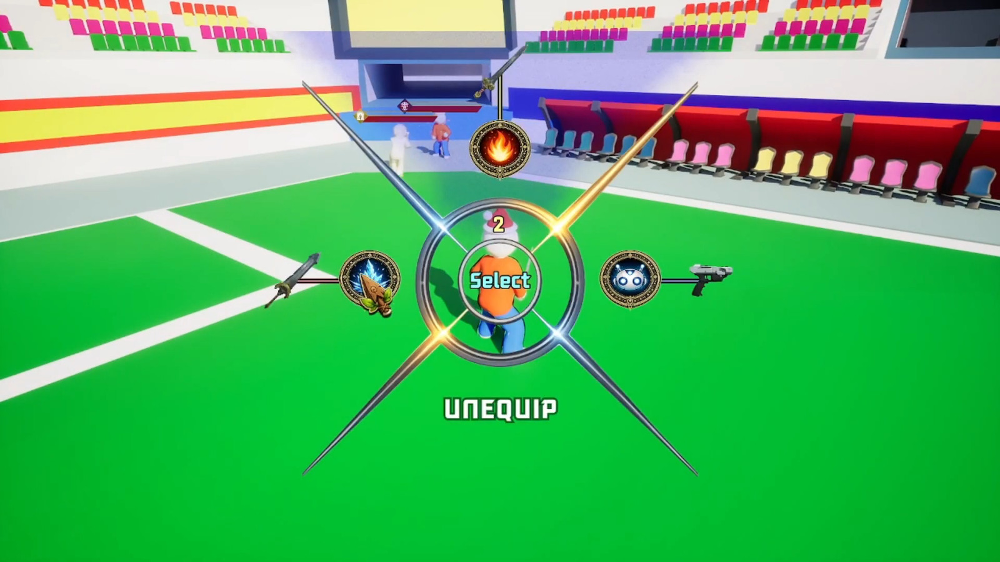
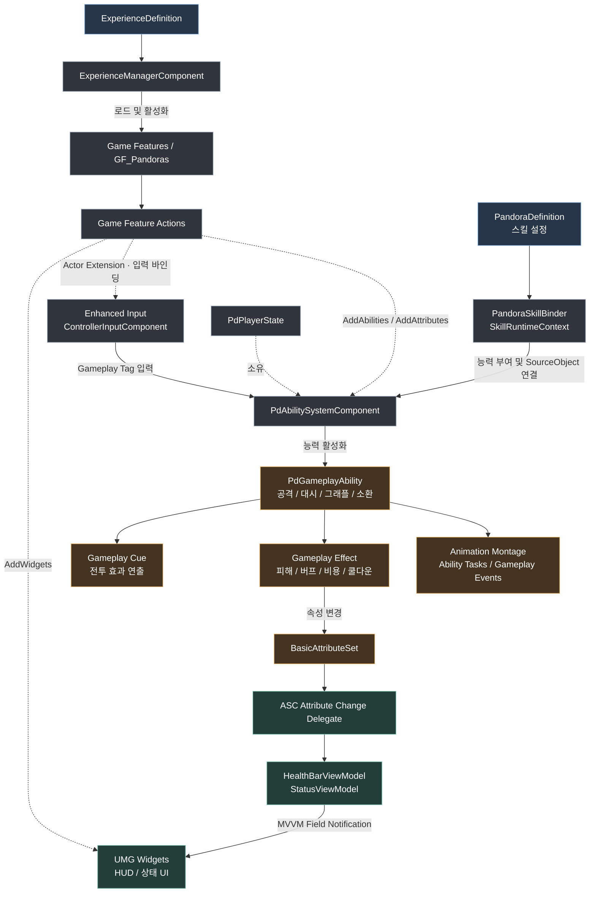
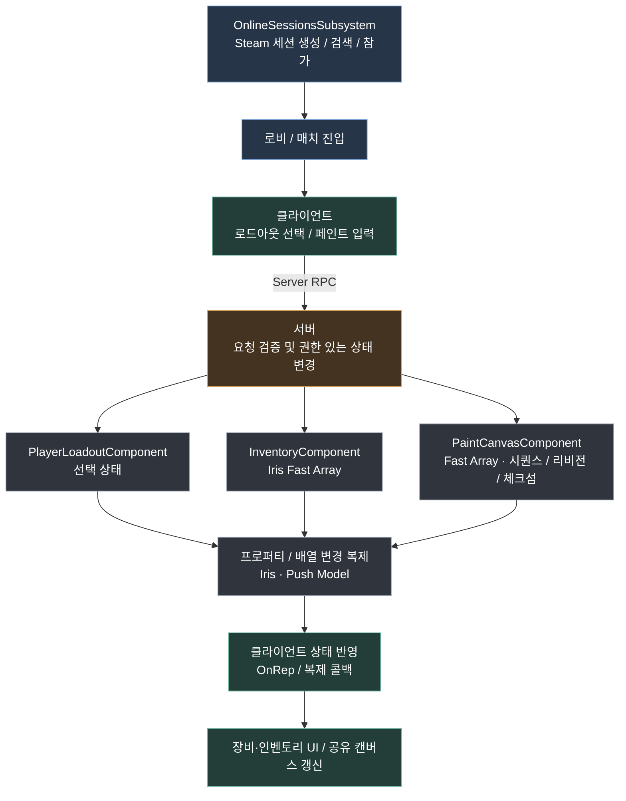

# PandoraBattle

Unreal Engine 기반 멀티플레이 액션 게임의 기술 포트폴리오입니다.



| 항목 | 내용 |
| --- | --- |
| 엔진 | Unreal Engine 5.7 |
| 개발 언어 | C++, Blueprint |
| 주요 기술 | Gameplay Ability System, Game Features, Iris, Push Model, MVVM, Online Subsystem |

## 시스템 구성

### 기능 초기화부터 전투·UI까지

Experience가 Game Feature를 활성화하고, 각 Action이 능력·속성·입력·위젯을 구성합니다. 플레이어의 ASC는 `PdPlayerState`가 소유하며, 입력 태그와 판도라 스킬 바인딩이 이 ASC로 연결됩니다. 실선은 주요 처리 흐름, 점선은 구성·소유 관계를 나타냅니다.



관련 코드: [Experience 로딩](Source/LabProject/Component/Experience/ExperienceManagerComponent.cpp) · [PlayerState의 ASC 소유](Source/LabProject/Mode/PdPlayerState.cpp) · [입력 태그 전달](Source/LabProject/Component/Player/ControllerInputComponent.cpp) · [속성 변경과 ViewModel 연결](Source/LabProject/ViewModel/HealthBarViewModel.cpp)

### 멀티플레이 요청과 상태 복제

Steam 세션이 연결과 참가를 담당하고, 게임 안의 로드아웃·공유 페인트 변경 요청은 서버 RPC로 처리합니다. 아래는 해당 기능의 요청·복제 흐름입니다. GAS 능력 실행은 위 그림의 ASC 흐름을 따릅니다.



관련 코드: [세션 요청](Source/LabProject/Online/OnlineSessionsSubsystem.h) · [로드아웃 서버 처리](Source/LabProject/Component/Player/PlayerLoadoutComponent.cpp) · [인벤토리 복제](Source/LabProject/Component/Item/InventoryComponentReplication.cpp) · [공유 캔버스 동기화](Source/LabProject/Component/Player/PaintCanvasComponent.cpp)

## 핵심 구현

### 데이터 기반 전투 구성

GAS의 Ability, Attribute, Gameplay Effect를 기반으로 전투를 구현합니다. 판도라와 스킬 정의를 런타임 객체에 연결하고, 능력 실행에 필요한 리소스·이동·연출·소스 처리를 나누어 관리합니다.

- [Ability 구현](Source/LabProject/AbilitySystem/Ability)
- [Ability 런타임 구성](Source/LabProject/Component/AbilitySystem/Ability)
- [판도라 스킬 바인딩](Source/LabProject/Pandora/PandoraSkillBinder.cpp)

### Experience와 Game Features

Experience 정의에 따라 콘텐츠를 로드하고 Game Feature 플러그인을 활성화합니다. 로딩·완료·실패·비활성화 상태를 관리하며, Game Feature Action을 통해 Ability, Attribute, Widget과 Actor Extension을 적용합니다.

- [ExperienceManagerComponent](Source/LabProject/Component/Experience/ExperienceManagerComponent.h)
- [Game Feature Actions](Source/LabProject/GameFeature)
- [GF_Pandoras 플러그인](Plugins/GameFeatures/GF_Pandoras)

### 서버 권한과 네트워크 동기화

Iris와 Push Model을 사용하며, 인벤토리와 공유 페인트 데이터에는 Fast Array 기반 복제를 적용합니다. 로드아웃 변경은 서버 RPC로 처리하고, 페인트 동기화에는 시퀀스·리비전·체크섬을 사용합니다.

- [인벤토리 복제](Source/LabProject/Component/Item/InventoryComponentReplication.cpp)
- [로드아웃 변경](Source/LabProject/Component/Player/PlayerLoadoutComponent.cpp)
- [페인트 캔버스 동기화](Source/LabProject/Component/Player/PaintCanvasComponent.cpp)

### 온라인 세션과 UI

Online Subsystem 기반의 세션 요청에 요청 ID와 취소 처리를 두고, 로비 흐름을 별도 구성 요소로 관리합니다. UI는 Widget, Controller, ViewModel을 나누고 MVVM을 활용해 상태를 표시합니다.

- [OnlineSessionsSubsystem](Source/LabProject/Online/OnlineSessionsSubsystem.h)
- [로비 구성](Source/LabProject/Lobby)
- [ViewModel](Source/LabProject/ViewModel)
- [UI 구성](Source/LabProject/UI)

## 프로젝트 구조

```text
LabProject.uproject
Source/
├── LabProject/
│   ├── AbilitySystem/       # 전투 능력, 효과, 투사체, 타기팅
│   ├── Component/           # 플레이어, 인벤토리, GAS, Experience 구성
│   ├── Definition/          # Primary Data Asset 기반 콘텐츠 정의
│   ├── GameFeature/         # 기능 주입과 Actor Extension
│   ├── Lobby/               # 로비 및 매치 조정
│   ├── Online/              # 세션 및 업적
│   ├── Pandora/             # 판도라 인스턴스와 스킬 바인딩
│   ├── SavedGameData/       # 프로필 저장과 로드
│   ├── UI/                  # 위젯과 UI 컨트롤러
│   └── ViewModel/           # MVVM 상태 표현
└── LabProjectEditor/        # 에디터 모듈
Plugins/
└── GameFeatures/GF_Pandoras/
Content/                    # 공개 대상 Blueprint·Data Asset 등
Config/                     # 엔진, 입력, 태그 및 패키징 설정
Docs/                       # 구현 참고 문서와 이미지
```

## 테스트 코드

Ability System과 플레이어 구성·로드아웃 동작을 검증하는 Unreal Automation Test 코드입니다.

- [Ability System 테스트](Source/LabProject/Component/AbilitySystem/Tests)
- [플레이어·로드아웃 테스트](Source/LabProject/Component/Player/Tests)
