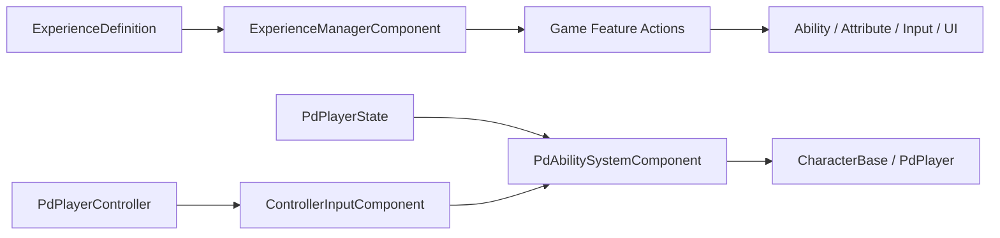

# PandoraBattle

Unreal Engine 기반 멀티플레이 액션 게임의 기술 포트폴리오입니다. 무기와 Pandora의 조합으로 전투하고, 로비에서 선택한 구성을 경기로 이어갑니다.

| 항목 | 내용 |
| --- | --- |
| 엔진 | Unreal Engine 5.8 |
| 개발 언어 | C++, Blueprint |
| 핵심 기술 | GAS, Enhanced Input, Experience / Game Features, Iris / Push Model / Fast Array, CommonUI, MVVM, Online Subsystem |

## 시스템 구성

### 콘텐츠 준비와 플레이어 수명

`ExperienceDefinition`은 현재 World의 콘텐츠와 Game Feature를 정의합니다. `ExperienceManagerComponent`는 로드·활성화·해제를 관리하고, Game Feature Action은 Ability·Attribute·입력·Widget 구성을 적용합니다. Definition은 정적 설정이고, 실행 상태와 정리 책임은 runtime 객체에 있습니다.


```mermaid
flowchart LR
    D[ExperienceDefinition] --> E[ExperienceManagerComponent]
    E --> F[Game Feature Actions]
    F --> G[Ability / Attribute / Input / UI]
    PS[PdPlayerState] --> ASC[PdAbilitySystemComponent]
    PC[PdPlayerController] --> INPUT[ControllerInputComponent]
    INPUT --> ASC
    ASC --> PAWN[CharacterBase / PdPlayer]
```

| 계층 | 책임 |
| --- | --- |
| `APdPlayerController` | 로컬 명령, possession, 입력·presentation·profile sync·session Component 연결 |
| `APdPlayerState` | Pawn 교체 후 유지되는 플레이어 상태, GAS owner, Inventory·Pandora·Skin ownership |
| `ACharacterBase` / `APdPlayer` | 현재 Pawn의 이동·충돌·장비 표현과 플레이어 전용 Component 구성 |
| `Definition/<Domain>` | DataAsset 기반 전투·지급·맵·UI·입력 설정 |
| `UContentDataSubsystem` / `FContentLease` | 콘텐츠 조회·비동기 로딩 / consumer 수명 동안의 리소스 보유 |

관련 코드: [Experience](Source/LabProject/Component/Experience) · [Game Feature](Source/LabProject/GameFeature) · [PlayerState](Source/LabProject/Mode/PdPlayerState.h)

### 전투와 GAS

입력은 ASC와 `AbilityGrantAndInputManager`를 거쳐 Ability에 전달됩니다. `SkillAbility`는 한 번의 시전과 비용·쿨다운·종료를 관리하고, `SkillAction`은 Definition에 구성된 기능을 실행합니다. Skill Actor는 월드 runtime, GameplayCue는 표현, AnimNotify는 timing signal을 담당합니다.

`PandoraComponent`는 Pandora 보유·선택·loadout을 관리합니다. `PandoraSkillSource`는 Ability Spec의 SourceObject로 연결되며 스킬 identity와 activation context를 전달합니다.

```text
Input → ASC / AbilityGrantAndInputManager → GameplayAbility
                                        → SkillAbility → SkillAction → Effect / Actor
Animation → AnimNotify / GameplayEvent → Ability / Equipment / Weapon
```

관련 코드: [Ability](Source/LabProject/AbilitySystem/Ability) · [SkillAction](Source/LabProject/Skill/Actions) · [Pandora](Source/LabProject/Component/Pandora)

### Inventory와 Equipment

- `ItemDefinition`은 정적 콘텐츠, `ItemInstance`는 수량·강화값·ID를 가진 보유 아이템입니다.
- `InventoryComponent`는 ownership과 Quick Slot·장비 슬롯·무기 loadout 참조를 복제합니다.
- `SelectingPandoraAndWeaponComponent`는 현재 선택 슬롯을 유지하고 Weapon/Pandora 적용을 조율합니다.
- `EquipmentComponent`는 equip/unequip transaction, 현재 Weapon Actor, 장비 능력치와 Ability/Effect를 관리합니다.
- `WeaponBase`와 파생 Actor는 현재 Pawn의 무기 실행·표현 객체입니다.

기본 지급의 원본은 `DA_DefaultProvision`입니다. `ItemGrants`의 명시적 수량·Quick Slot 설정이 우선하며, `GrantAllItems.TrainingRoom`은 훈련방에서 전체 ItemDefinition을 추가 지급합니다. Pandora·상태 포인트·Gesture 지급도 이 DataAsset을 사용합니다.

관련 코드: [Inventory](Source/LabProject/Component/Item) · [Equipment](Source/LabProject/Component/Player/EquipmentComponent.h) · [Provision](Source/LabProject/Provision)

### 멀티플레이와 Lobby / Match / Online

클라이언트의 gameplay 요청은 서버에서 검증하고, 서버가 변경한 상태를 Iris·Push Model·Fast Array 및 OnRep로 전달합니다. 로컬 UI·카메라와 gameplay authority를 분리합니다.

| 시스템 | 책임 |
| --- | --- |
| Lobby GameMode/GameState와 Component | 참가자·팀·경기 설정·시작 조건 및 복제 |
| `LobbyTravelCoordinator` | Lobby → Match travel transaction |
| `LobbyRuntimeSubsystem` | World를 넘어 필요한 loadout·paint·결과 cache와 preload |
| `MatchFlowComponent` | 경기 진행·timer·승패·Golden Kill·보상·결과 |
| Lobby/Match PlayerSetup Component | 플레이어 콘텐츠 준비와 기본 지급 순서 |
| `OnlineSessionsSubsystem` | Steam/Online Subsystem 기반 Create·Find·Join·Start·End·Destroy 비동기 lifecycle |

관련 코드: [Lobby](Source/LabProject/Lobby) · [Match](Source/LabProject/Component/Match) · [Online](Source/LabProject/Online)

### AI와 Character 표현

Monster는 StateTree, Training Bot은 BehaviorTree를 사용합니다. Controller는 감지·판단·AI graph 수명, `EnemyCombatComponent`는 공통 전투, `EnemyTrainingBotComponent`는 훈련용 무기 교체·피격·respawn을 담당합니다. Pet은 replicated follow target을 기준으로 BehaviorTree 또는 direct follow fallback을 수행합니다.

`CharacterPresentationComponent`는 공통 시각 상태, `PlayerAimComponent`는 replicated aim과 이동 상태, `PlayerCameraComponent`는 로컬 카메라 연출을 담당합니다. Grapple의 trace·서버 검증·이동 복원은 `GrappleComponent`에 있습니다. Paint는 Component가 데이터·RenderTarget·네트워크를, Display가 말풍선·얼굴 decal을 소유합니다.

관련 코드: [AI](Source/LabProject/AI) · [Character Component](Source/LabProject/Component/Character) · [Paint](Source/LabProject/Component/Player/PaintCanvas)

### UI와 저장

CommonUI 기반 `UUiSubsystem` / `UUiScreen`과 `UPdUIActionRouter`가 화면·입력 수명을 관리합니다. HUD Router/Layer는 메뉴·Info·scoreboard를 구성하고, Info는 Widget·Presenter·LoadoutStore로 역할을 나눕니다. UI 폴더는 HUD·Info·Pandora·Shop 등 기능별로 배치되어 있습니다. 일부 상태 UI는 MVVM ViewModel을 사용합니다.

`PlayerProfileSubsystem`은 단일 로컬 profile의 progression과 저장을 담당합니다. `LocalProfile`, backup, shutdown snapshot 중 유효한 최신 revision을 복구하며, 저장 Envelope는 CRC와 경량 난독화를 담당합니다. Audio·Input·Language 설정은 별도 slot입니다. 저장 호환성을 위해 profile SaveGame의 기존 reflected class 이름은 유지합니다.

Skin은 PlayerState의 `SkinComponent`가 보유 목록을, Pawn의 `SkinEquipmentComponent`가 장착 외형·Pet·Gesture를 관리합니다. 비 Gesture Skin의 `bGrantedByDefault`는 기본 profile ownership을 결정하며, Gesture 기본 지급·슬롯 배치는 `DA_DefaultProvision.GestureGrants`가 결정합니다.

관련 코드: [UI](Source/LabProject/UI) · [Profile](Source/LabProject/Profile) · [Skin](Source/LabProject/Component/Skin)

## 프로젝트 구조

```text
Source/LabProject/
├─ AbilitySystem/ · Skill/ · Animation/   # GAS와 스킬 실행, animation signal
├─ Character/ · AI/ · Pet/ · Weapon/     # 월드 Actor
├─ Component/                           # owner별 gameplay/runtime 기능
├─ Definition/ · Data/                  # 정적 설정 / 콘텐츠 로딩·조회
├─ Experience/ · GameFeature/           # World 구성과 runtime 확장
├─ Mode/ · Lobby/ · Room/ · Online/      # 게임 흐름과 session
├─ Provision/ · Profile/                # 기본 지급 / 로컬 progression 저장
├─ Audio/ · Localization/ · Settings/   # 오디오·언어·로컬 설정
└─ UI/ · ViewModel/                     # 기능별 화면과 표시 상태
Source/LabProjectEditor/                # Editor 모듈
Plugins/GameFeatures/GF_Pandoras/       # Experience가 사용하는 Game Feature
Content/                               # Blueprint·DataAsset·맵·표현 리소스
Config/                                # 프로젝트 설정과 호환 redirect
```

## 빌드와 실행

Unreal Engine 5.8 및 Win64 C++ 개발 도구가 필요합니다. `LabProject.uproject`에서 프로젝트 파일을 생성하고 `LabProjectEditor / Development Editor`를 빌드해 에디터를 실행합니다. 게임 target은 `LabProject / Win64 Development`입니다.

PIE에서 Title의 훈련방 또는 로비 진입 경로를 사용합니다. 멀티플레이는 Listen Server와 Client로 확인할 수 있으며, 실제 Steam session 연결은 별도 계정·네트워크 환경이 필요합니다. 빌드 성공과 gameplay/network 기능 검증은 별개입니다.